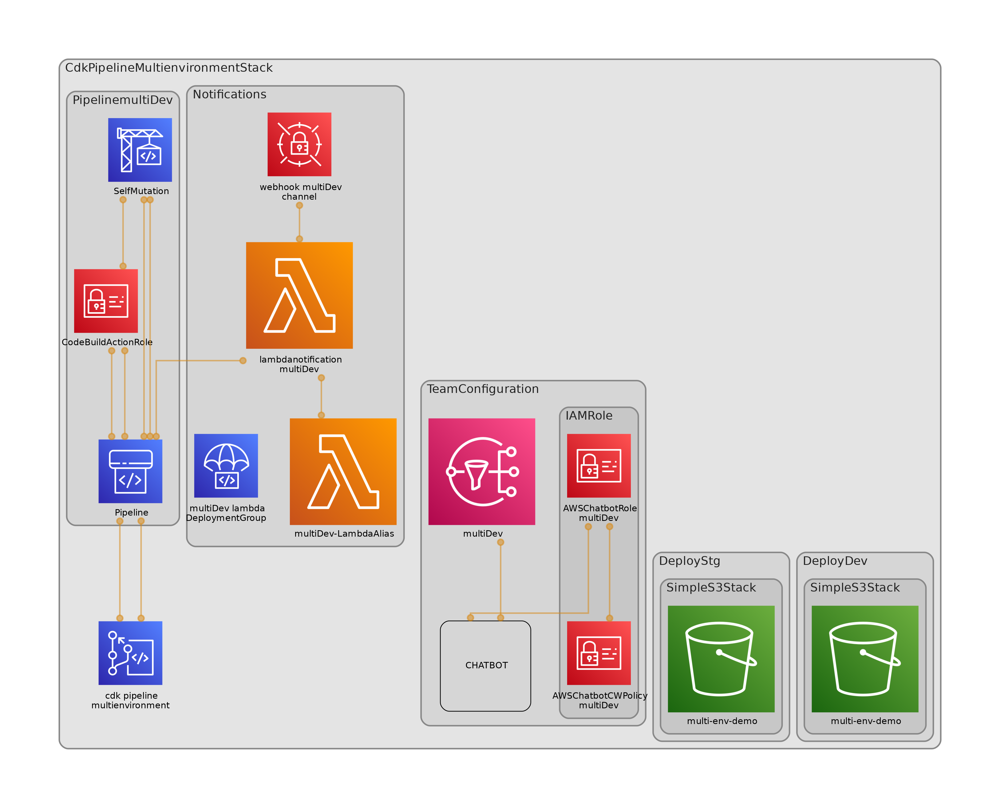

<!-- START doctoc generated TOC please keep comment here to allow auto update -->
<!-- DON'T EDIT THIS SECTION, INSTEAD RE-RUN doctoc TO UPDATE -->

- [CDK Pipelines Multi Environment Devployment](#cdk-pipelines-multi-environment-devployment)
  - [Solution Overview](#solution-overview)
- [How to](#how-to)
  - [Code structure](#code-structure)
  - [Parametrize the project](#parametrize-the-project)
  - [Useful commands](#useful-commands)

<!-- END doctoc generated TOC please keep comment here to allow auto update -->

# CDK Pipelines Multi Environment Devployment

This is a project for CDK development with Python for creating multi AWS account deployment.

## Solution Overview

<center>


 Solution Overview – Enhanced CDK Pipeline

</center>
The Figure shows the steps to accomplish this task. Also, it shows a cross account pipeline using AWS CodePipeline, AWS CodeCommit, AWS Codebuild and AWS CloudFormation. But, how can you construct this pipeline secure and with the minimum effort? The answer [CDK Pipelines](https://docs.aws.amazon.com/cdk/v2/guide/cdk_pipeline.html).

This pipeline is a default pipeline composed by next steps:
1.The changes are detected and activate de pipeline. For this demo the branch master is the default branch.
2.The CDK project is synthesized if is aligned with AWS Security Best practices.
3.The pipeline run self-update action.
4.The unit test runs, and its report is published in codebuild reports group.
5.The SAST runs, and its report is published in codebuild reports group.
6.The Cloudformation stack is prepared for developer environment.
7.The Cloudformation stack is deployed for developer environment after success result from Cloudformation hooks.
8.To move between environments a manual approval step is added, the notification is sent to slack channel.
9.The Cloudformation stack is prepared for staging environment.
10.The Cloudformation stack is deployed for staging environment after success result from Cloudformation hooks.

# How to

The `cdk.json` file tells the CDK Toolkit how to execute your app.

This project is set up like a standard Python project. The initialization
process also creates a virtualenv within this project, stored under the `.venv`
directory. To create the virtualenv it assumes that there is a `python3`
(or `python` for Windows) executable in your path with access to the `venv`
package. If for any reason the automatic creation of the virtualenv fails,
you can create the virtualenv manually.

To manually create a virtualenv on MacOS and Linux:

```
$ python3 -m venv .venv
```

After the init process completes and the virtualenv is created, you can use the following
step to activate your virtualenv.

```
$ source .venv/bin/activate
```

If you are a Windows platform, you would activate the virtualenv like this:

```
% .venv\Scripts\activate.bat
```

Once the virtualenv is activated, you can install the required dependencies.

```
$ pip install -r requirements.txt
```

At this point you can now synthesize the CloudFormation template for this code.

```
$ cdk synth
```

To add additional dependencies, for example other CDK libraries, just add
them to your `setup.py` file and rerun the `pip install -r requirements.txt`
command.

## Code structure

The following diagram shows the code stacks and structure.



## Parametrize the project

All project definitions are in `project_configs/environment_options/environment_options_template.yaml`
> Please Visit [avelez](https://dev.to/avelez) in Dev.to for more.

2. Create a new file with name `environment_options.yaml` and change the accounts ids.

3. Deploy main stack `CdkPipelineMultienvironmentStack`

## Useful commands

* `cdk ls`          list all stacks in the app
* `cdk synth`       emits the synthesized CloudFormation template
* `cdk deploy`      deploy this stack to your default AWS account/region
* `cdk diff`        compare deployed stack with current state
* `cdk docs`        open CDK documentation

Enjoy!
